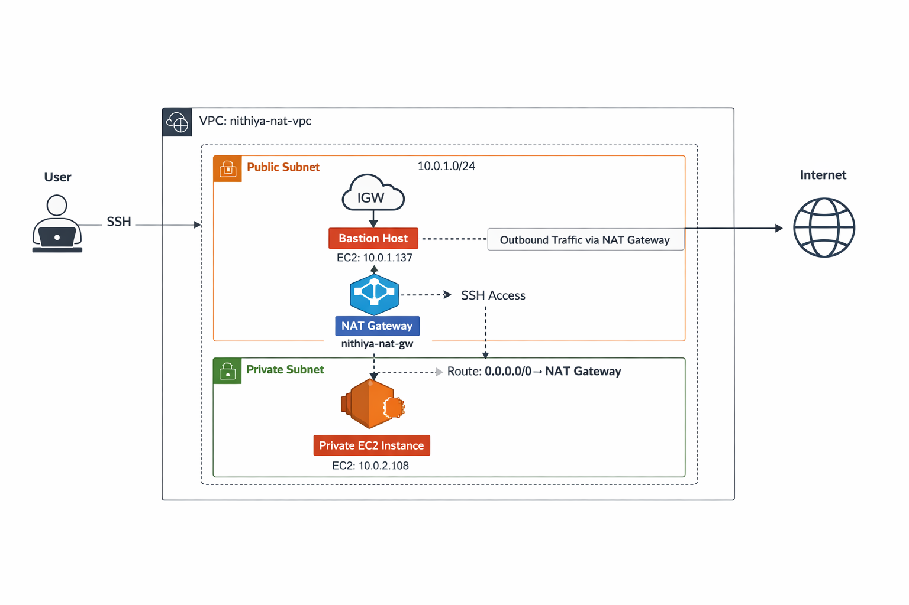
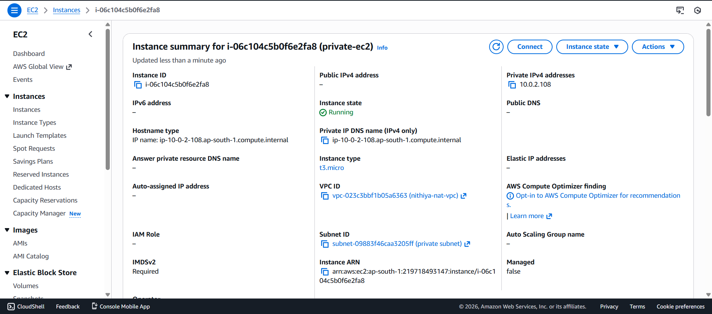
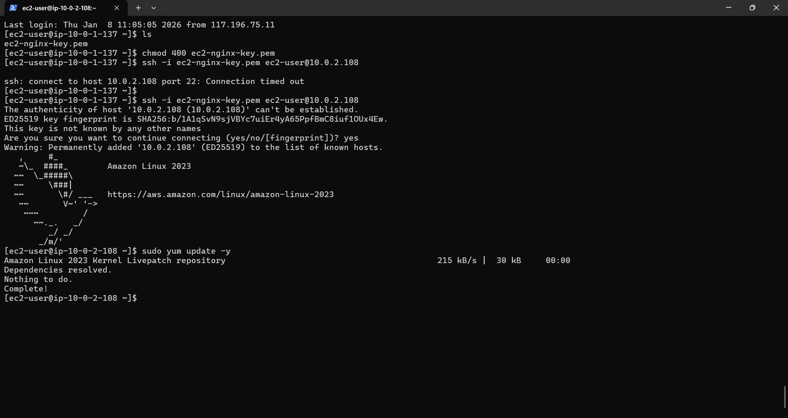

# AWS Mini Project 10 - NAT Gateway Project: Private EC2 with Secure Internet Access

## 📌 Project Overview
This project demonstrates how to deploy a **private EC2 instance** in a custom VPC with **secure outbound internet access** using a **NAT Gateway**. Public and private subnets are clearly separated following AWS best practices. A bastion host in the public subnet is used for secure SSH access to the private EC2.

---

## 🏗️ Architecture Diagram


**Key Components:**
- **VPC:** Custom isolated network (`10.0.0.0/16`)  
- **Public Subnet:** Contains NAT Gateway & Bastion Host  
- **Private Subnet:** Contains Private EC2 (no public IP)  
- **Internet Gateway:** Connects VPC to Internet  
- **Route Tables:** Public → IGW, Private → NAT Gateway  

---

## 📸 Project Screenshots
1. **VPC Overview:**   
2. **VPC Route Table → NAT Gateway:**   
3. **Private EC2 (No Public IP):**   
4. **Terminal NAT Test:**   

---

## 🧠 Key Learnings
- Difference between public & private subnets  
- How NAT Gateway provides secure outbound access  
- Route table configuration for proper internet routing  
- Using Bastion host for private subnet SSH access  
- Secure architecture for production-grade AWS setup  

---

## 🎯 Result
- Private EC2 connected via Bastion host ✅  
- Internet access outbound works via NAT Gateway ✅  
- Private EC2 **no public IP** → secure ✅  
- Project tested and verified ✅  

---

## 🔹 Notes
- All resources were **deleted after testing** to ensure **Free Tier safety**  
- NAT Gateway was active only during testing  
- Elastic IP was released  

---

## 💻 Commands Used for Verification
```bash
# Check private EC2 IP
ip a | grep inet

# Test outbound internet via NAT
sudo yum update -y

